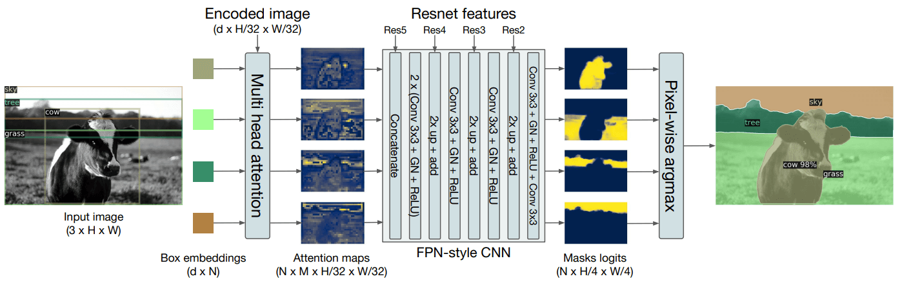

# DETR with Panoptic Segmentation for a Custom Dataset - 

## CapStone Project for EVA6 course from TSAI - 

### **Question -**

As a part of the CAPSTONE project you need to explain missing: 
1. We take the encoded image (dxH/32xW/32) and send it to Multi-Head Attention (FROM WHERE DO WE TAKE THIS ENCODED IMAGE?) 
   We also send dxN Box embeddings to the Multi-Head Attention 
2. We do something here to generate NxMxH/32xW/32 maps. (WHAT DO WE DO HERE?) 
3. Then we concatenate these maps with Res5 Block (WHERE IS THIS COMING FROM?) 
   
4. Then we perform the above steps (EXPLAIN THESE STEPS) 
   And then we are finally left with the panoptic segmentation 

### **Answers -**

1. The encoded image fed to the Multi-Head Attention is obtained from the  transformer encoder output. With this, we also 	   send the d x N Box embeddings to the Multi-Head Attention. 

2. The NxMxH/32xW/32 maps are obtained from the Multi-Head Attention layer that returns the attention scores over the			encoded image for each object embedding. 
	Basically, those attention scores gives us how related each and every pixel are to each other(Attention!). 
	Since, we get a small resolution outputs from the Multi-Head Attention, we would need to upsample it to original resolution. 
	This is done using the upsample CNN in the next step. 

3. The Res blocks are obtained at the beginning when we extract the activations of the intermediate layers after passing the 	input image(3xHxW) through a CNN with 5 Residual Blocks. 

4.	A binary mask is generated for each detected object after going through the upsample CNN, then these masks are merged 		using pixel-wise argmax to get a single output where no overlaps of multiple classes are there. 
    So, to predict the final panoptic segmentation we simply use an argmax over the mask scores at each pixel and assign the corresponding categories to the resulting masks. 

#### In our case - 
1. We get our segmentation masks from the pre-traiend model. 
2. We then delete the mask which is obtained from the DETR model wherever our mask or "thing or class" is present.  
   Except from class, eveything else should be considered as stuff for panoptic segmentation.  
3. This will be then fed into the network for retraining to get the final predictions. 
4. These predictions or mask logits are then upsampled to original resolution by passing through the CNN obtained at the 		beginning. 
5. These masks are merged using pixel-wise argmax to get a single output where no overlaps of multiple classes are there. 
    So, to predict the final panoptic segmentation we simply use an argmax over the mask scores at each pixel and assign the corresponding categories to the resulting masks. 
