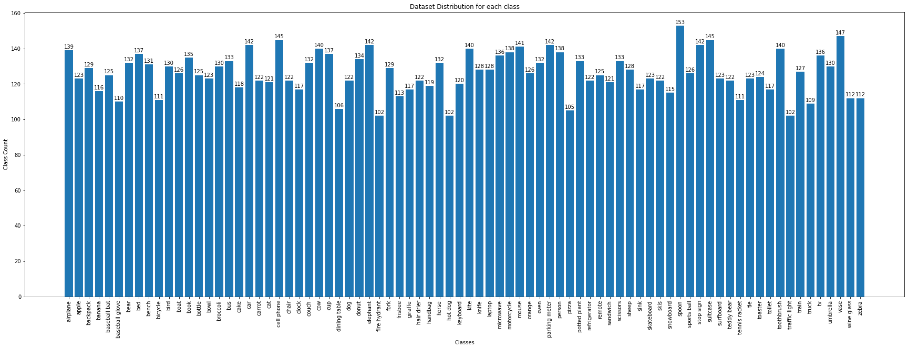
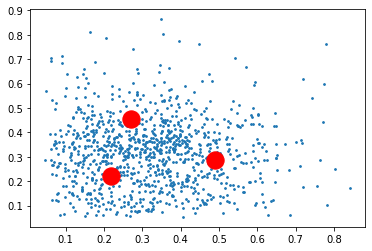
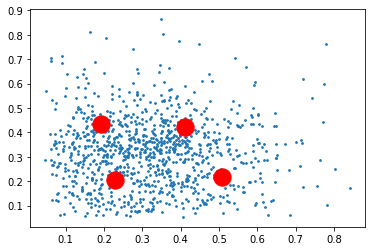
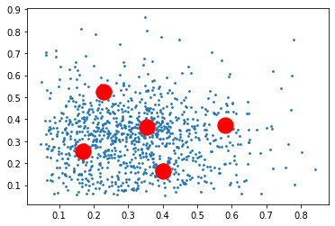
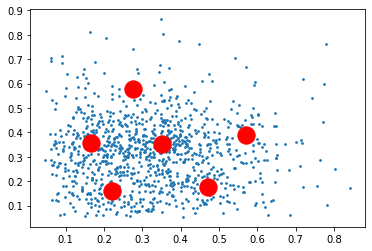
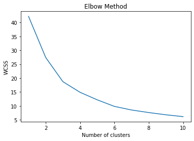

# Session10 - 

## Problem Statement - 
### Assignment B: 
Download this  downloadfile. Learn how COCO object detection dataset's schema is. This file has the same schema. You'll need to discover what those number are.  
Identify these things for this dataset: 
readme data for class distribution (along with the class names) along with a graph  
Calculate the Anchor Boxes for k = 3, 4, 5, 6 and draw them. 
Share the calculations for both via a notebook uploaded on your GitHub Repo  

## COCO Dataset - 

COCO is a large-scale object detection, segmentation, and captioning dataset. COCO has several features: 

Object segmentation 
Recognition in context  
Superpixel stuff segmentation 
330K images (>200K labeled) 
1.5 million object instances 
80 object categories 
91 stuff categories 
5 captions per image 
250,000 people with keypoints 

Classes contained in the Dataset inlcude -      

'person','bicycle','car','motorcycle','airplane','bus','train','truck','boat','traffic light','fire hydrant','stop sign','parking meter','bench','bird', 
'cat','dog','horse','sheep','cow','elephant','bear','zebra','giraffe','backpack','umbrella','handbag','tie','suitcase','frisbee','skis','snowboard','sports  ball','kite','baseball bat','baseball glove','skateboard','surfboard','tennis racket','bottle','wine  glass','cup','fork','knife','spoon','bowl','banana','apple','sandwich','orange','broccoli','carrot','hot  dog','pizza','donut','cake','chair','couch','potted plant','bed','dining table','toilet','tv','laptop','mouse','remote','keyboard','cell  phone','microwave','oven','toaster','sink','refrigerator','book','clock','vase','scissors','teddy bear','hair drier','toothbrush' 

## Class Distribution for COCO Dataset - 

### Some additional info on the Dataset - 

RangeIndex: 10105 entries, 0 to 10104
Data columns (total 8 columns):
 #   Column       Non-Null Count  Dtype  
---  ------       --------------  -----  
 0   id           10105 non-null  int64  
 1   height       10105 non-null  float64
 2   width        10105 non-null  float64
 3   x            10105 non-null  float64
 4   y            10105 non-null  float64
 5   bbox_width   10105 non-null  float64
 6   bbox_height  10105 non-null  float64
 7   class        10105 non-null  object 
dtypes: float64(6), int64(1), object(1)
memory usage: 631.7+ KB

## Finding k-means for n_clusters = 3

## Finding k-means for n_clusters = 4

## Finding k-means for n_clusters = 5

## Finding k-means for n_clusters = 6

## Finding ideal n_clusters through elbow method 

## BBOXes based on calculations for all the Ks

