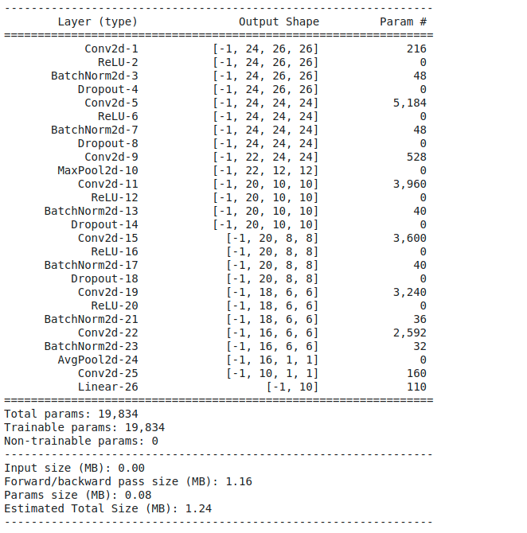
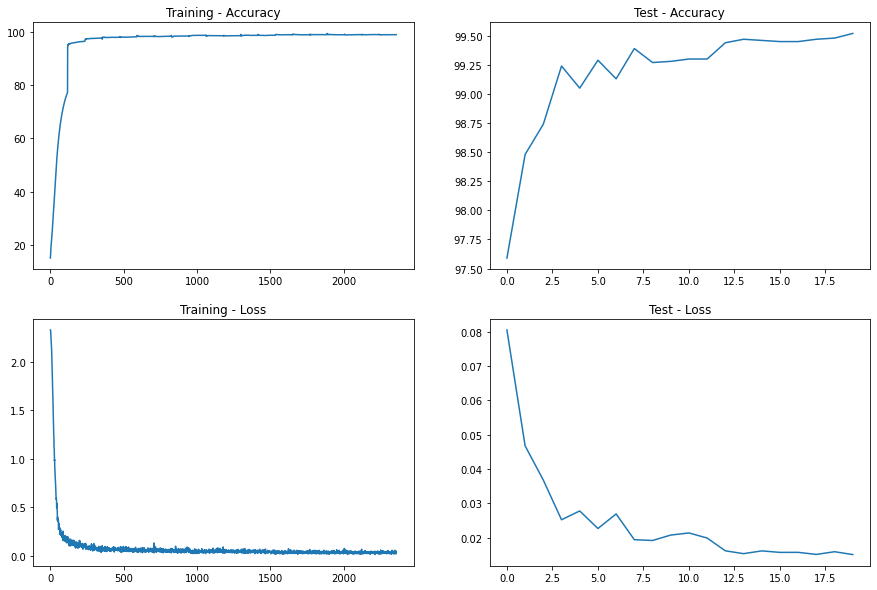
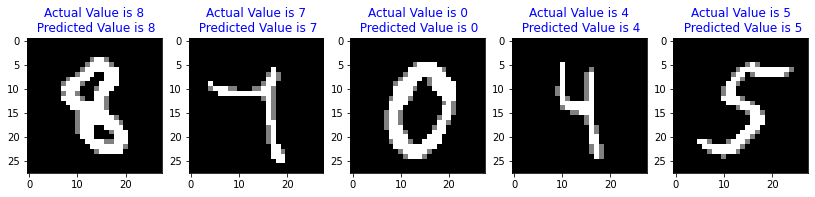
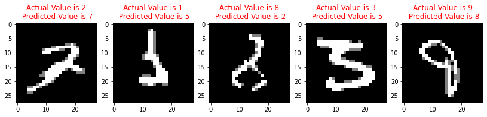

## 
 Assignment 4 

### **Group Members**             
•	Sarthak Dargan – sarthak221995@gmail.com                
•	CV Chiranthan - chiranthancv95@gmail.com                   
•	Mayank Singhal - singhal.mayank77@gmail.com  [ Currently Affected with COVID 19 ]    
• Jayasankar Raju S - muralis2raj@gmail.com  

## Part 2 - MNIST DIGITS PYTORCH CLASSIFIER

**Best solution Results** : Achieved 99.52% Accuracy on Test Data on 19th Epoch with Total Trainable Params: 19,834. 

**Key Steps** : 
1. We Started with augmenting the training data. We applied Random Rotations, Scaling, Shearing transformations.
2. Created Train Loader and Test Loader
3. Designed the Neural Network using Convolution layers/Max Pool/Dropouts/GAP/Batch Normalization/FC with Total Trainable Params:19,834
4. Train and Test the Model

**Data Augmentation:**

## Data Augmentations:
RandomRotation and RandomAffine 

Concatenated the train data twice one set with data augmentations and other without augmentations    

    train_loader = torch.utils.data.DataLoader(
        ConcatDataset([
                    datasets.MNIST('../data', train=True, download=True,
                        transform=transforms.Compose([
                            transforms.ToTensor(),
                            transforms.Normalize((0.1307,), (0.3081,))
                        ])),
                    datasets.MNIST('../data', train=True, download=True,
                        transform=transforms.Compose([
                            transforms.ToTensor(),
                            transforms.RandomRotation(10),
                            transforms.RandomAffine(degrees=10, shear=45),
                            transforms.Normalize((0.1307,), (0.3081,))
                        ])),
        ]),batch_size=batch_size, shuffle=True, **kwargs) 

### Model Summary : 

### Optimizer and Learning Rate
Used three learning rates based on accuracy

    model =  Net().to(device)
    optimizer1 = optim.SGD(model.parameters(), lr=0.05, momentum=0.9)
    optimizer2 = optim.SGD(model.parameters(), lr=0.02, momentum=0.9)
    optimizer3 = optim.SGD(model.parameters(), lr=0.01, momentum=0.9)
    EPOCHS = 20
    acc = 0
    for epoch in range(EPOCHS):
        print("EPOCH:", epoch)
        if acc < 99.35:
        train(model, device, train_loader, optimizer1, epoch)
        acc = test(model, device, test_loader)
        elif (acc>99.35) & (acc<99.42) :
        train(model, device, train_loader, optimizer2, epoch)
        acc = test(model, device, test_loader)
        elif acc>99.42:
        train(model, device, train_loader, optimizer3, epoch)
        acc = test(model, device, test_loader)

### Loss - Error Graph: 

### Correct and Incorrect Predictions : 

