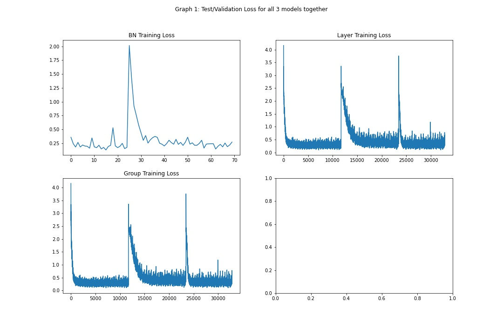
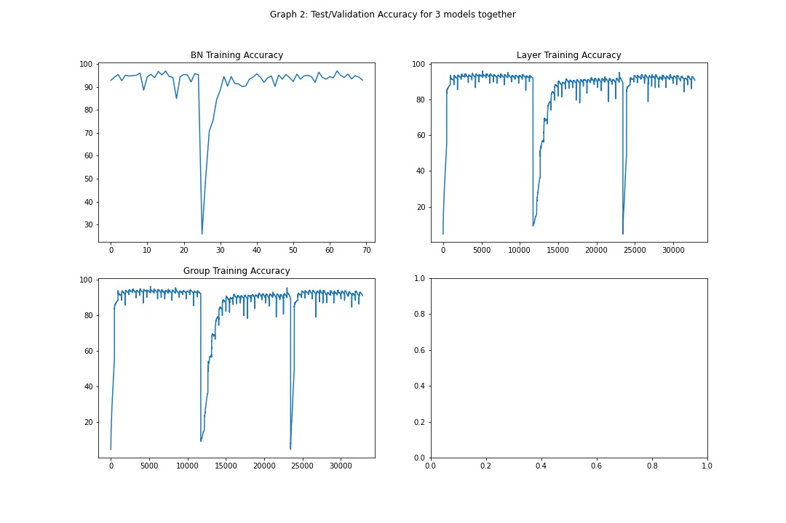
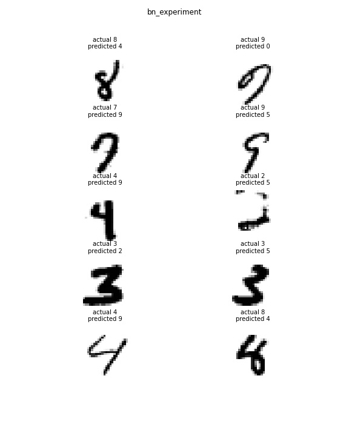
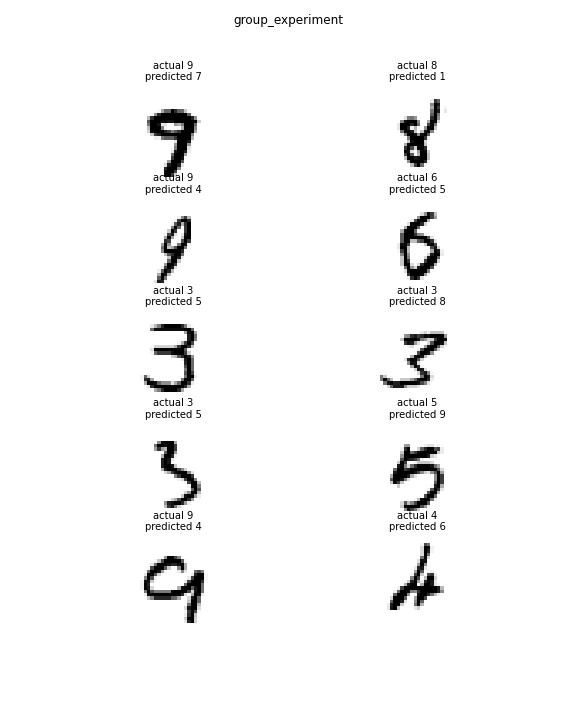
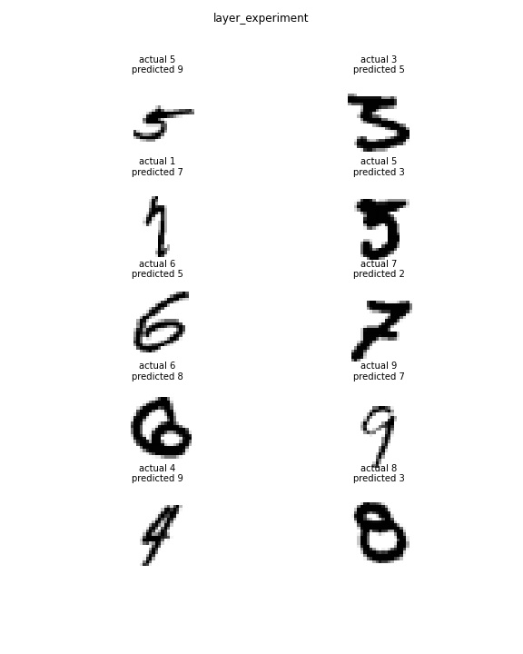

# Session 6 - BATCH NORMALIZATION & REGULARIZATION

## Assignment:

You are making 3 versions of your 5th assignment's best model (or pick one from best assignments):
Network with Group Normalization
Network with Layer Normalization
Network with L1 + BN
You MUST:
Write a single model.py file that includes GN/LN/BN and takes an argument to decide which normalization to include
Write a single notebook file to run all the 3 models above for 20 epochs each
Create these graphs:
Graph 1: Test/Validation Loss for all 3 models together
Graph 2: Test/Validation Accuracy for 3 models together
graphs must have proper annotation
Find 10 misclassified images for each of the 3 models, and show them as a 5x2 image matrix in 3 separately annotated images. 
write an explanatory README file that explains:
what is your code all about,
how to perform the 3 covered normalization (cannot use values from the excel sheet shared)
your findings for normalization techniques,
add all your graphs
your 3 collection-of-misclassified-images 
Upload your complete assignment on GitHub and share the link on LMS
Mention the name of your partners who are doing the assignment. If someone submits separately, then we will see who scored lowest, and we will assign the lowest to all. If there are NO partners, then mention there are NO parters and make sure NO one mentions your name. 

### Usage - 
```bash 
python main --norm group --epochs 25
```

Note - options available are bn+l1, group and layer normalization experiments

## Info - 
The notebook '3models_notebook.ipynb' contains all the 3 models with batchnorm, group and layer normalization experiments.<br>
It contains all the Graphs and misclassfied images displayed.<br>

## Normalization Excel workout

[Normalization Worksheet](https://github.com/chiranthancv95/EVA6_TSAI/blob/main/Session6/Normalizations.xlsx)


## Inference on experiments

1. Batchnorm + L1 - 
This experiment yielded good results, compratively to other experiments.
The test accuracy has actually dropped when compared with just the batchnorm experiment.<br>
Adding the L1 loss, has introduced a higher loss than usual.
So, it needs adjustment and requires recalculation of lambda_l1. parameter.

2. Group Normalization - 
This experiment is done using the Group Normalization.
The groups were split up into half of the number of output channels.
This was done to get the gamma and beta parameters are calculated equally throughout.
But, according to the results(found in the notebook), we can see that there is a large drop in accuracy here compared to bn experiment.
So, for additional steps, we could create groups of different sizes and experiment with that later.

3. Layer Normalization - 
This experiment is done using the Layer normalization.
The Pytorch layer of Group Norm has been used with a slight modfication making the number of groups as 1 to convert it to use layer normalization.
We see that, the test accuracy we got for this experiment is slightly better than the Group Normalization around 2%.

## Graph 1: Test/Validation Loss for all 3 models together



## Graph 2: Test/Validation Accuracy for 3 models together



## 3 collection-of-misclassified-images 









 Team
 ----      
CV Chiranthan - chiranthancv95@gmail.com <br>
Sarthak - sarthak221995@gmail.com<br>


