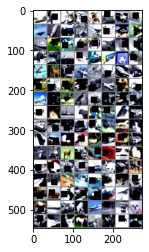
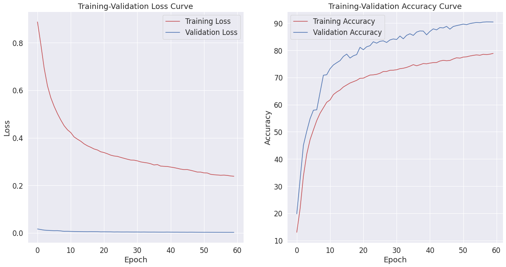

# Assignemnt 7 (Late Assignment but on time)
## Problem statement:-
1. change the code such that it uses GPU
    * change the architecture to C1C2C3C40  (No MaxPooling, but 3 3x3 layers with stride of 2 instead) (If you can figure out how to use Dilated kernels here instead of MP or          strided convolution, then 200pts extra!)
    * total RF must be more than 52
    * two of the layers must use Depthwise Separable Convolution
    * one of the layers must use Dilated Convolution
    * use GAP (compulsory mapped to # of classes):- CANNOT add FC after GAP to target #of classes
    * use albumentation library and apply:
        * HorizontalFlip(p=0.3)
        * ShiftScaleRotate(shift_limit=0.1, scale_limit=0.1, rotate_limit=30, interpolation=cv2.INTER_LINEAR, border_mode=cv2.BORDER_REFLECT_101, always_apply=False, p=0.5)
        * CoarseDropout(max_holes = 1, max_height=16, max_width=16, min_holes = 1, min_height=16, min_width=16, fill_value=(0.4914, 0.4822, 0.4465), mask_fill_value = None)
        * grayscale
    * achieve 87% accuracy, as many epochs as you want. Total Params to be less than 100k.

## CIFAR-10 Vizualization And Augmentation

Dataset Info: CIFAR-10 has 10 classes of 32,32 that are airplane, automobile, bird, cat, deer, dog, frog, horse, ship, truck

## Data Augumentation:-

The data augumentation techniques used are:-
* HorizontalFlip
* ShiftScaleRotate
* CoarseDropout
* Normalize
* ToGray
* ToTensorV2

## Best Model:-

### Model Summary:-

----------------------------------------------------------------
        Layer (type)               Output Shape         Param #
================================================================
            Conv2d-1           [-1, 32, 32, 32]             864
       BatchNorm2d-2           [-1, 32, 32, 32]              64
              ReLU-3           [-1, 32, 32, 32]               0
           Dropout-4           [-1, 32, 32, 32]               0
            Conv2d-5           [-1, 32, 32, 32]           9,216
       BatchNorm2d-6           [-1, 32, 32, 32]              64
              ReLU-7           [-1, 32, 32, 32]               0
           Dropout-8           [-1, 32, 32, 32]               0
            Conv2d-9           [-1, 32, 16, 16]           9,216
      BatchNorm2d-10           [-1, 32, 16, 16]              64
             ReLU-11           [-1, 32, 16, 16]               0
          Dropout-12           [-1, 32, 16, 16]               0
           Conv2d-13           [-1, 64, 16, 16]          18,432
      BatchNorm2d-14           [-1, 64, 16, 16]             128
             ReLU-15           [-1, 64, 16, 16]               0
          Dropout-16           [-1, 64, 16, 16]               0
           Conv2d-17             [-1, 64, 8, 8]             576
           Conv2d-18             [-1, 64, 8, 8]           4,160
DepthwiseSeparable-19             [-1, 64, 8, 8]               0
      BatchNorm2d-20             [-1, 64, 8, 8]             128
             ReLU-21             [-1, 64, 8, 8]               0
          Dropout-22             [-1, 64, 8, 8]               0
           Conv2d-23             [-1, 64, 8, 8]             576
           Conv2d-24            [-1, 128, 8, 8]           8,320
DepthwiseSeparable-25            [-1, 128, 8, 8]               0
      BatchNorm2d-26            [-1, 128, 8, 8]             256
             ReLU-27            [-1, 128, 8, 8]               0
          Dropout-28            [-1, 128, 8, 8]               0
           Conv2d-29             [-1, 32, 8, 8]           4,096
      BatchNorm2d-30             [-1, 32, 8, 8]              64
             ReLU-31             [-1, 32, 8, 8]               0
          Dropout-32             [-1, 32, 8, 8]               0
           Conv2d-33             [-1, 32, 6, 6]           9,216
           Conv2d-34             [-1, 32, 4, 4]           9,216
      BatchNorm2d-35             [-1, 32, 4, 4]              64
             ReLU-36             [-1, 32, 4, 4]               0
          Dropout-37             [-1, 32, 4, 4]               0
           Conv2d-38             [-1, 32, 4, 4]           9,216
             ReLU-39             [-1, 32, 4, 4]               0
           Conv2d-40             [-1, 10, 4, 4]           2,880
        AvgPool2d-41             [-1, 10, 1, 1]               0
================================================================
Total params: 86,816
Trainable params: 86,816
Non-trainable params: 0
----------------------------------------------------------------
Input size (MB): 0.01
Forward/backward pass size (MB): 3.38
Params size (MB): 0.33
Estimated Total Size (MB): 3.72

## Model's Receptive Field, FLOPS other calculations

____________________________________________________________________________________________________________
Layer                        Type                  Output Shape              Param #         Receptive field
============================================================================================================
net                          Net                   (-1, 10)                  0               67             
├─convblock1                 Sequential            (-1, 32, 32, 32)          10,338          67             
├─transblock1                Sequential            (-1, 32, 16, 16)          9,345           63             
├─convblock2                 Sequential            (-1, 64, 16, 16)          18,689          31             
├─transblock2                Sequential            (-1, 64, 8, 8)            4,993           29             
├─convblock3                 Sequential            (-1, 32, 8, 8)            13,634          14             
├─transblock3                Sequential            (-1, 32, 4, 4)            18,561          12             
├─convblock4                 Sequential            (-1, 10, 4, 4)            12,096          8              
├─gap                        AvgPool2d             (-1, 10, 1, 1)            0               4              
============================================================================================================
Trainable params: 86,816
Non-trainable params: 0
Total params: 86,816
------------------------------------------------------------------------------------------------------------
Model size (params + buffers): 0.33 Mb
Framework & CUDA overhead: -0.36 Mb
Total RAM usage: -0.03 Mb
------------------------------------------------------------------------------------------------------------
Floating Point Operations on forward: 39.34 MFLOPs
Multiply-Accumulations on forward: 19.72 MMACs
Direct memory accesses on forward: 20.03 MDMAs

### Training Logs:-

  0%|          | 0/391 [00:00<?, ?it/s]Epoch 1:
Loss=2.1719889640808105 Batch_id=390 Accuracy=12.97: 100%|██████████| 391/391 [00:14<00:00, 27.83it/s]
  0%|          | 0/391 [00:00<?, ?it/s]
Test set: Average loss: 0.0165, Accuracy: 9883/50000 (19.77%)

Epoch 2:
Loss=1.9014451503753662 Batch_id=390 Accuracy=21.64: 100%|██████████| 391/391 [00:13<00:00, 28.08it/s]
  0%|          | 0/391 [00:00<?, ?it/s]
Test set: Average loss: 0.0139, Accuracy: 16200/50000 (32.40%)

Epoch 3:
Loss=1.6400508880615234 Batch_id=390 Accuracy=33.71: 100%|██████████| 391/391 [00:13<00:00, 28.60it/s]
  0%|          | 0/391 [00:00<?, ?it/s]
Test set: Average loss: 0.0115, Accuracy: 22525/50000 (45.05%)

Epoch 4:
Loss=1.4724667072296143 Batch_id=390 Accuracy=41.78: 100%|██████████| 391/391 [00:13<00:00, 28.43it/s]
  0%|          | 0/391 [00:00<?, ?it/s]
Test set: Average loss: 0.0106, Accuracy: 25098/50000 (50.20%)

Epoch 5:
Loss=1.3281852006912231 Batch_id=390 Accuracy=47.10: 100%|██████████| 391/391 [00:14<00:00, 27.71it/s]
  0%|          | 0/391 [00:00<?, ?it/s]
Test set: Average loss: 0.0097, Accuracy: 27411/50000 (54.82%)

Epoch 6:
Loss=1.2315219640731812 Batch_id=390 Accuracy=50.68: 100%|██████████| 391/391 [00:13<00:00, 28.56it/s]
  0%|          | 0/391 [00:00<?, ?it/s]
Test set: Average loss: 0.0092, Accuracy: 28973/50000 (57.95%)

Epoch 7:
Loss=1.2887800931930542 Batch_id=390 Accuracy=54.13: 100%|██████████| 391/391 [00:13<00:00, 28.25it/s]
  0%|          | 0/391 [00:00<?, ?it/s]
Test set: Average loss: 0.0094, Accuracy: 29048/50000 (58.10%)

Epoch 8:
Loss=1.1877275705337524 Batch_id=390 Accuracy=56.83: 100%|██████████| 391/391 [00:13<00:00, 28.27it/s]
  0%|          | 0/391 [00:00<?, ?it/s]
Test set: Average loss: 0.0081, Accuracy: 32234/50000 (64.47%)

Epoch 9:
Loss=1.1160725355148315 Batch_id=390 Accuracy=58.85: 100%|██████████| 391/391 [00:14<00:00, 27.68it/s]
  0%|          | 0/391 [00:00<?, ?it/s]
Test set: Average loss: 0.0064, Accuracy: 35415/50000 (70.83%)

Epoch 10:
Loss=1.0894850492477417 Batch_id=390 Accuracy=60.87: 100%|██████████| 391/391 [00:13<00:00, 27.94it/s]
  0%|          | 0/391 [00:00<?, ?it/s]
Test set: Average loss: 0.0065, Accuracy: 35509/50000 (71.02%)

Epoch 11:
Loss=1.07767915725708 Batch_id=390 Accuracy=61.73: 100%|██████████| 391/391 [00:13<00:00, 28.18it/s]
  0%|          | 0/391 [00:00<?, ?it/s]
Test set: Average loss: 0.0060, Accuracy: 36612/50000 (73.22%)

Epoch 12:
Loss=0.8625583648681641 Batch_id=390 Accuracy=63.70: 100%|██████████| 391/391 [00:13<00:00, 28.41it/s]
  0%|          | 0/391 [00:00<?, ?it/s]
Test set: Average loss: 0.0056, Accuracy: 37303/50000 (74.61%)

Epoch 13:
Loss=1.0385239124298096 Batch_id=390 Accuracy=64.66: 100%|██████████| 391/391 [00:14<00:00, 27.37it/s]
  0%|          | 0/391 [00:00<?, ?it/s]
Test set: Average loss: 0.0055, Accuracy: 37717/50000 (75.43%)

Epoch 14:
Loss=0.8587749600410461 Batch_id=390 Accuracy=65.40: 100%|██████████| 391/391 [00:14<00:00, 26.98it/s]
  0%|          | 0/391 [00:00<?, ?it/s]
Test set: Average loss: 0.0053, Accuracy: 38102/50000 (76.20%)

Epoch 15:
Loss=0.9635968208312988 Batch_id=390 Accuracy=66.51: 100%|██████████| 391/391 [00:14<00:00, 26.67it/s]
  0%|          | 0/391 [00:00<?, ?it/s]
Test set: Average loss: 0.0050, Accuracy: 38875/50000 (77.75%)

Epoch 16:
Loss=0.9825060963630676 Batch_id=390 Accuracy=67.24: 100%|██████████| 391/391 [00:15<00:00, 25.77it/s]
  0%|          | 0/391 [00:00<?, ?it/s]
Test set: Average loss: 0.0048, Accuracy: 39307/50000 (78.61%)

Epoch 17:
Loss=1.063963770866394 Batch_id=390 Accuracy=67.97: 100%|██████████| 391/391 [00:14<00:00, 27.06it/s]
  0%|          | 0/391 [00:00<?, ?it/s]
Test set: Average loss: 0.0051, Accuracy: 38581/50000 (77.16%)

Epoch 18:
Loss=0.9841490983963013 Batch_id=390 Accuracy=68.45: 100%|██████████| 391/391 [00:14<00:00, 27.04it/s]
  0%|          | 0/391 [00:00<?, ?it/s]
Test set: Average loss: 0.0050, Accuracy: 38995/50000 (77.99%)

Epoch 19:
Loss=1.1272060871124268 Batch_id=390 Accuracy=68.94: 100%|██████████| 391/391 [00:14<00:00, 26.38it/s]
  0%|          | 0/391 [00:00<?, ?it/s]
Test set: Average loss: 0.0048, Accuracy: 39219/50000 (78.44%)

Epoch 20:
Loss=0.7084499597549438 Batch_id=390 Accuracy=69.71: 100%|██████████| 391/391 [00:14<00:00, 26.48it/s]
  0%|          | 0/391 [00:00<?, ?it/s]
Test set: Average loss: 0.0042, Accuracy: 40560/50000 (81.12%)

Epoch 21:
Loss=0.8015631437301636 Batch_id=390 Accuracy=69.76: 100%|██████████| 391/391 [00:14<00:00, 26.98it/s]
  0%|          | 0/391 [00:00<?, ?it/s]
Test set: Average loss: 0.0044, Accuracy: 40110/50000 (80.22%)

Epoch 22:
Loss=0.7645106911659241 Batch_id=390 Accuracy=70.35: 100%|██████████| 391/391 [00:14<00:00, 26.55it/s]
  0%|          | 0/391 [00:00<?, ?it/s]
Test set: Average loss: 0.0042, Accuracy: 40653/50000 (81.31%)

Epoch 23:
Loss=0.7866044640541077 Batch_id=390 Accuracy=70.89: 100%|██████████| 391/391 [00:14<00:00, 26.35it/s]
  0%|          | 0/391 [00:00<?, ?it/s]
Test set: Average loss: 0.0042, Accuracy: 40856/50000 (81.71%)

Epoch 24:
Loss=0.809195876121521 Batch_id=390 Accuracy=70.98: 100%|██████████| 391/391 [00:14<00:00, 26.32it/s]
  0%|          | 0/391 [00:00<?, ?it/s]
Test set: Average loss: 0.0038, Accuracy: 41580/50000 (83.16%)

Epoch 25:
Loss=0.8912637829780579 Batch_id=390 Accuracy=71.17: 100%|██████████| 391/391 [00:14<00:00, 26.60it/s]
  0%|          | 0/391 [00:00<?, ?it/s]
Test set: Average loss: 0.0040, Accuracy: 41321/50000 (82.64%)

Epoch 26:
Loss=0.893017590045929 Batch_id=390 Accuracy=71.56: 100%|██████████| 391/391 [00:14<00:00, 26.19it/s]
  0%|          | 0/391 [00:00<?, ?it/s]
Test set: Average loss: 0.0037, Accuracy: 41669/50000 (83.34%)

Epoch 27:
Loss=0.93833988904953 Batch_id=390 Accuracy=72.21: 100%|██████████| 391/391 [00:14<00:00, 26.28it/s]
  0%|          | 0/391 [00:00<?, ?it/s]
Test set: Average loss: 0.0037, Accuracy: 41744/50000 (83.49%)

Epoch 28:
Loss=0.6286603212356567 Batch_id=390 Accuracy=72.23: 100%|██████████| 391/391 [00:14<00:00, 26.38it/s]
  0%|          | 0/391 [00:00<?, ?it/s]
Test set: Average loss: 0.0038, Accuracy: 41449/50000 (82.90%)

Epoch 29:
Loss=0.9416089057922363 Batch_id=390 Accuracy=72.65: 100%|██████████| 391/391 [00:14<00:00, 26.49it/s]
  0%|          | 0/391 [00:00<?, ?it/s]
Test set: Average loss: 0.0036, Accuracy: 41915/50000 (83.83%)

Epoch 30:
Loss=0.6793246865272522 Batch_id=390 Accuracy=72.69: 100%|██████████| 391/391 [00:14<00:00, 27.17it/s]
  0%|          | 0/391 [00:00<?, ?it/s]
Test set: Average loss: 0.0036, Accuracy: 42098/50000 (84.20%)

Epoch 31:
Loss=1.0895979404449463 Batch_id=390 Accuracy=72.85: 100%|██████████| 391/391 [00:14<00:00, 26.42it/s]
  0%|          | 0/391 [00:00<?, ?it/s]
Test set: Average loss: 0.0036, Accuracy: 41995/50000 (83.99%)

Epoch 32:
Loss=0.9365921020507812 Batch_id=390 Accuracy=73.25: 100%|██████████| 391/391 [00:14<00:00, 26.57it/s]
  0%|          | 0/391 [00:00<?, ?it/s]
Test set: Average loss: 0.0033, Accuracy: 42637/50000 (85.27%)

Epoch 33:
Loss=0.7378602027893066 Batch_id=390 Accuracy=73.41: 100%|██████████| 391/391 [00:14<00:00, 27.19it/s]
  0%|          | 0/391 [00:00<?, ?it/s]
Test set: Average loss: 0.0035, Accuracy: 42125/50000 (84.25%)

Epoch 34:
Loss=0.802169919013977 Batch_id=390 Accuracy=73.72: 100%|██████████| 391/391 [00:14<00:00, 26.14it/s]
  0%|          | 0/391 [00:00<?, ?it/s]
Test set: Average loss: 0.0033, Accuracy: 42767/50000 (85.53%)

Epoch 35:
Loss=0.7683363556861877 Batch_id=390 Accuracy=74.17: 100%|██████████| 391/391 [00:14<00:00, 26.15it/s]
  0%|          | 0/391 [00:00<?, ?it/s]
Test set: Average loss: 0.0031, Accuracy: 43051/50000 (86.10%)

Epoch 36:
Loss=0.8062880635261536 Batch_id=390 Accuracy=74.72: 100%|██████████| 391/391 [00:14<00:00, 26.46it/s]
  0%|          | 0/391 [00:00<?, ?it/s]
Test set: Average loss: 0.0032, Accuracy: 42749/50000 (85.50%)

Epoch 37:
Loss=0.8149957656860352 Batch_id=390 Accuracy=74.32: 100%|██████████| 391/391 [00:14<00:00, 26.64it/s]
  0%|          | 0/391 [00:00<?, ?it/s]
Test set: Average loss: 0.0030, Accuracy: 43359/50000 (86.72%)

Epoch 38:
Loss=0.7171933650970459 Batch_id=390 Accuracy=74.69: 100%|██████████| 391/391 [00:15<00:00, 25.93it/s]
  0%|          | 0/391 [00:00<?, ?it/s]
Test set: Average loss: 0.0029, Accuracy: 43576/50000 (87.15%)

Epoch 39:
Loss=0.5604422092437744 Batch_id=390 Accuracy=75.13: 100%|██████████| 391/391 [00:15<00:00, 25.91it/s]
  0%|          | 0/391 [00:00<?, ?it/s]
Test set: Average loss: 0.0029, Accuracy: 43550/50000 (87.10%)

Epoch 40:
Loss=0.823570728302002 Batch_id=390 Accuracy=75.05: 100%|██████████| 391/391 [00:14<00:00, 26.29it/s]
  0%|          | 0/391 [00:00<?, ?it/s]
Test set: Average loss: 0.0032, Accuracy: 42855/50000 (85.71%)

Epoch 41:
Loss=0.6300328373908997 Batch_id=390 Accuracy=75.30: 100%|██████████| 391/391 [00:14<00:00, 26.22it/s]
  0%|          | 0/391 [00:00<?, ?it/s]
Test set: Average loss: 0.0030, Accuracy: 43483/50000 (86.97%)

Epoch 42:
Loss=0.7603219747543335 Batch_id=390 Accuracy=75.49: 100%|██████████| 391/391 [00:14<00:00, 26.17it/s]
  0%|          | 0/391 [00:00<?, ?it/s]
Test set: Average loss: 0.0028, Accuracy: 43954/50000 (87.91%)

Epoch 43:
Loss=0.4608677327632904 Batch_id=390 Accuracy=75.52: 100%|██████████| 391/391 [00:14<00:00, 26.38it/s]
  0%|          | 0/391 [00:00<?, ?it/s]
Test set: Average loss: 0.0028, Accuracy: 43772/50000 (87.54%)

Epoch 44:
Loss=0.9340268969535828 Batch_id=390 Accuracy=76.06: 100%|██████████| 391/391 [00:15<00:00, 25.90it/s]
  0%|          | 0/391 [00:00<?, ?it/s]
Test set: Average loss: 0.0026, Accuracy: 44193/50000 (88.39%)

Epoch 45:
Loss=0.6771047115325928 Batch_id=390 Accuracy=76.32: 100%|██████████| 391/391 [00:14<00:00, 26.12it/s]
  0%|          | 0/391 [00:00<?, ?it/s]
Test set: Average loss: 0.0027, Accuracy: 44125/50000 (88.25%)

Epoch 46:
Loss=0.7387124300003052 Batch_id=390 Accuracy=76.17: 100%|██████████| 391/391 [00:14<00:00, 26.18it/s]
  0%|          | 0/391 [00:00<?, ?it/s]
Test set: Average loss: 0.0025, Accuracy: 44413/50000 (88.83%)

Epoch 47:
Loss=0.4290551245212555 Batch_id=390 Accuracy=76.28: 100%|██████████| 391/391 [00:14<00:00, 26.27it/s]
  0%|          | 0/391 [00:00<?, ?it/s]
Test set: Average loss: 0.0027, Accuracy: 43898/50000 (87.80%)

Epoch 48:
Loss=0.825774073600769 Batch_id=390 Accuracy=76.81: 100%|██████████| 391/391 [00:14<00:00, 26.58it/s]
  0%|          | 0/391 [00:00<?, ?it/s]
Test set: Average loss: 0.0026, Accuracy: 44387/50000 (88.77%)

Epoch 49:
Loss=0.726393461227417 Batch_id=390 Accuracy=77.26: 100%|██████████| 391/391 [00:14<00:00, 26.43it/s]
  0%|          | 0/391 [00:00<?, ?it/s]
Test set: Average loss: 0.0025, Accuracy: 44550/50000 (89.10%)

Epoch 50:
Loss=0.8767334818840027 Batch_id=390 Accuracy=77.13: 100%|██████████| 391/391 [00:14<00:00, 26.27it/s]
  0%|          | 0/391 [00:00<?, ?it/s]
Test set: Average loss: 0.0024, Accuracy: 44681/50000 (89.36%)

Epoch 51:
Loss=0.6576653122901917 Batch_id=390 Accuracy=77.51: 100%|██████████| 391/391 [00:14<00:00, 26.17it/s]
  0%|          | 0/391 [00:00<?, ?it/s]
Test set: Average loss: 0.0024, Accuracy: 44835/50000 (89.67%)

Epoch 52:
Loss=0.7123035192489624 Batch_id=390 Accuracy=77.62: 100%|██████████| 391/391 [00:14<00:00, 26.16it/s]
  0%|          | 0/391 [00:00<?, ?it/s]
Test set: Average loss: 0.0024, Accuracy: 44730/50000 (89.46%)

Epoch 53:
Loss=0.6160961985588074 Batch_id=390 Accuracy=77.91: 100%|██████████| 391/391 [00:14<00:00, 26.30it/s]
  0%|          | 0/391 [00:00<?, ?it/s]
Test set: Average loss: 0.0023, Accuracy: 44926/50000 (89.85%)

Epoch 54:
Loss=0.528564989566803 Batch_id=390 Accuracy=78.14: 100%|██████████| 391/391 [00:14<00:00, 26.50it/s]
  0%|          | 0/391 [00:00<?, ?it/s]
Test set: Average loss: 0.0023, Accuracy: 45039/50000 (90.08%)

Epoch 55:
Loss=0.648318886756897 Batch_id=390 Accuracy=78.32: 100%|██████████| 391/391 [00:14<00:00, 26.35it/s]
  0%|          | 0/391 [00:00<?, ?it/s]
Test set: Average loss: 0.0022, Accuracy: 45133/50000 (90.27%)

Epoch 56:
Loss=0.5499426126480103 Batch_id=390 Accuracy=78.18: 100%|██████████| 391/391 [00:14<00:00, 26.90it/s]
  0%|          | 0/391 [00:00<?, ?it/s]
Test set: Average loss: 0.0022, Accuracy: 45089/50000 (90.18%)

Epoch 57:
Loss=0.45561447739601135 Batch_id=390 Accuracy=78.54: 100%|██████████| 391/391 [00:14<00:00, 26.07it/s]
  0%|          | 0/391 [00:00<?, ?it/s]
Test set: Average loss: 0.0022, Accuracy: 45205/50000 (90.41%)

Epoch 58:
Loss=0.582534670829773 Batch_id=390 Accuracy=78.44: 100%|██████████| 391/391 [00:14<00:00, 26.74it/s]
  0%|          | 0/391 [00:00<?, ?it/s]
Test set: Average loss: 0.0022, Accuracy: 45238/50000 (90.48%)

Epoch 59:
Loss=0.5326922535896301 Batch_id=390 Accuracy=78.59: 100%|██████████| 391/391 [00:14<00:00, 26.38it/s]
  0%|          | 0/391 [00:00<?, ?it/s]
Test set: Average loss: 0.0022, Accuracy: 45234/50000 (90.47%)

Epoch 60:
Loss=0.5246990919113159 Batch_id=390 Accuracy=78.87: 100%|██████████| 391/391 [00:15<00:00, 26.00it/s]

Test set: Average loss: 0.0022, Accuracy: 45224/50000 (90.45%)

### Goals Achieved:-
* Epochs - 60
* Total Params - **86,816 (Less than 100K)**
* Best Training Accuracy - **78.87**
* Best Testing Accuracy - **90.45%**

### Accuracy of each class:-
Accuracy of plane : 91 %
Accuracy of   car : 96 %
Accuracy of  bird : 85 %
Accuracy of   cat : 77 %
Accuracy of  deer : 88 %
Accuracy of   dog : 82 %
Accuracy of  frog : 89 %
Accuracy of horse : 91 %
Accuracy of  ship : 99 %
Accuracy of truck : 95 %

### Validation Loss and Accuracy Curve:-

## Contributors:-
1. CV Chiranthan